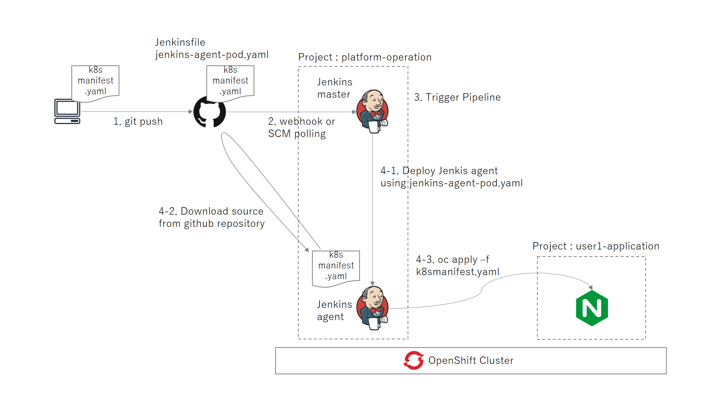

# OpenShift pipeline practice for manifest deploy

Jenkinsのジョブを利用してリポジトリ内のマニフェストをOpenShift上にデプロイする。



#### 環境

- OpenShift CodeReady Containers

  ```
  $ crc version
  crc version: 1.9.0+a68b5e0
  OpenShift version: 4.3.10 (embedded in binary)
  ```

- Jenkins 2.176.4

  

#### manifest deploy overview

1. ローカルリポジトリでk8sマニフェストをcommitし、GitHubのmasterブランチへpushする
2. GitHubのmasterブランチ上のk8sマニフェストが更新され、Jenkins側から当該リポジトリへのSCMポーリングにより更新を検知する

   - GitHub側からのwebhookでもいいし、Jenkins側からのSCMポーリングでもどちらでもいい
3. Jenkins は更新を検知すると マニフェストデプロイのJobを実行する

4. マニフェストデプロイのJobは以下の流れとなる

   - まず OpenShift 上に Pod として Jenkins agent がデプロイされる
     - このときにカスタムのJenkins agentを用いることも出来るが、今回はシンプルに [Jenkins Agent Base](https://quay.io/repository/openshift/origin-jenkins-agent-base?tag=latest&tab=tags) をそのまま使用した
   - Jenkins agent はGitHubのリポジトリをからソースをダウンロードする
   - その Jenkins agent が oc apply -f nginx-deployment.yamlを実行するすることで、マニフェストをデプロイする

     - Jenkins agent が user1-application の Project へデプロイできるように予め Service Account に権限付与しておく